# D&D Agent Database Schema

This document details the SQLite database schema (`dnd-agent.db`) used by the D&D campaign management CLI tool. The schema is highly relational, enforcing foreign keys, cascade deletes, and unique constraints to maintain campaign data integrity.

---

## Database Versioning
The database schema utilizes SQLite's built-in `PRAGMA user_version` value to manage forward-only schema migrations.
* **Current Version**: `6` (v1 base tables; v2 NPC ability scores; v3 creature campaign/location linkage; v4 creature stats/loot, NPC/creature feature junction tables; v5 character location/chapter; v6 combat stats, spellcasting, initiative, perception, languages, concentration, prof/skill/spell-slot junction tables).

The canonical source of truth for the schema lives in `lib/db.odin` — `db_init_schema` constructs each version's `CREATE TABLE` / `ALTER TABLE` statements. This document is a reference derived from that code.

---

## Entity Relationship Summary

```mermaid
erDiagram
    characters ||--o{ character_classes : "has"
    characters ||--o{ character_skills : "has"
    characters ||--o{ character_resources : "has"
    characters ||--o{ character_weapon_profs : "proficient_in"
    characters ||--o{ character_armor_profs : "proficient_in"
    characters ||--o{ character_tool_profs : "proficient_in"
    characters ||--o{ character_spell_slots : "has"
    characters ||--o{ companions : "has"
    characters ||--o{ character_spells : "knows"
    characters ||--o{ character_features : "has"
    characters ||--o{ faction_standings : "has"
    characters ||--o{ inventory : "holds"
    npcs ||--o{ inventory : "holds"
    npcs ||--o{ npc_skills : "has"
    creatures ||--o{ inventory : "holds"
    items ||--o{ inventory : "contained_in"
    spells ||--o{ character_spells : "known_by"
    features ||--o{ character_features : "possessed_by"
    npcs ||--o{ npc_features : "has"
    features ||--o{ npc_features : "possessed_by"
    creatures ||--o{ creature_features : "has"
    features ||--o{ creature_features : "possessed_by"
    campaigns ||--o{ locations : "contains"
    locations ||--o{ npcs : "contains"
    locations ||--o{ characters : "contains"
    locations ||--o{ creatures : "contains"
    factions ||--o{ faction_standings : "reputation"
    npcs ||--o{ npc_relationships : "relationship"
    campaigns ||--o{ story_actions : "logs"
    locations ||--o{ story_actions : "logs"
    story_actions ||--o{ story_action_actors : "actor"
```

---

## Detailed Table Reference

### 1. `characters`
Tracks player characters, base stats, current saving throw proficiencies, combat vitals, resting statuses, alignment, size, XP, and active campaign state.
* **Columns**:
  * `id`: `INTEGER` (PRIMARY KEY)
  * `name`: `TEXT NOT NULL`
  * `current_hp`: `INTEGER DEFAULT 0` (Current Hit Points)
  * `max_hp`: `INTEGER DEFAULT 1` (Max Hit Points)
  * `temp_hp`: `INTEGER DEFAULT 0` (Temporary Hit Points; depleted first in combat)
  * `death_saves_success`: `INTEGER DEFAULT 0` (Successes, 0-3)
  * `death_saves_failure`: `INTEGER DEFAULT 0` (Failures, 0-3)
  * `exhaustion`: `INTEGER DEFAULT 0` (Exhaustion Level, 0-6)
  * `hit_dice_expended`: `INTEGER DEFAULT 0` (Spent Hit Dice count)
  * `backstory`: `TEXT DEFAULT ''`
  * `owner`: `TEXT DEFAULT 'dm'`
  * `created_at`: `TEXT DEFAULT CURRENT_TIMESTAMP`
  * `str`: `INTEGER DEFAULT 10` (Strength score)
  * `dex`: `INTEGER DEFAULT 10` (Dexterity score)
  * `con`: `INTEGER DEFAULT 10` (Constitution score)
  * `int_`: `INTEGER DEFAULT 10` (Intelligence score)
  * `wis`: `INTEGER DEFAULT 10` (Wisdom score)
  * `cha`: `INTEGER DEFAULT 10` (Charisma score)
  * `save_prof_str`: `INTEGER DEFAULT 0` (Strength save proficiency: 0/1)
  * `save_prof_dex`: `INTEGER DEFAULT 0` (Dexterity save proficiency: 0/1)
  * `save_prof_con`: `INTEGER DEFAULT 0` (Constitution save proficiency: 0/1)
  * `save_prof_int`: `INTEGER DEFAULT 0` (Intelligence save proficiency: 0/1)
  * `save_prof_wis`: `INTEGER DEFAULT 0` (Wisdom save proficiency: 0/1)
  * `save_prof_cha`: `INTEGER DEFAULT 0` (Charisma save proficiency: 0/1)
  * `ac`: `INTEGER DEFAULT 10` (Armor Class)
  * `race`: `TEXT DEFAULT 'human'`
  * `speed`: `INTEGER DEFAULT 30` (Movement Speed in feet)
  * `status_effects`: `TEXT DEFAULT ''` (Comma-separated active conditions)
  * `resistances`: `TEXT DEFAULT ''` (Comma-separated damage types)
  * `vulnerabilities`: `TEXT DEFAULT ''` (Comma-separated damage types)
  * `immunities`: `TEXT DEFAULT ''` (Comma-separated damage types)
  * `gold`: `INTEGER DEFAULT 0` (Gold coins)
  * `silver`: `INTEGER DEFAULT 0` (Silver coins)
  * `copper`: `INTEGER DEFAULT 0` (Copper coins)
  * `platinum`: `INTEGER DEFAULT 0` (Platinum coins)
  * `electrum`: `INTEGER DEFAULT 0` (Electrum coins)
  * `inspiration`: `INTEGER DEFAULT 0` (Inspiration point: 0/1)
  * `alignment`: `TEXT DEFAULT 'neutral'` (e.g. `chaotic_good`)
  * `size`: `TEXT DEFAULT 'medium'` (e.g. `medium`, `small`)
  * `xp`: `INTEGER DEFAULT 0` (Experience Points)
  * `faction_id`: `INTEGER DEFAULT 0`
  * `campaign_id`: `INTEGER DEFAULT 0`
  * `last_action`: `TEXT DEFAULT ''` (Record of last combat action)
  * `party`: `TEXT DEFAULT ''` (Name of assigned party group)
  * `location_id`: `INTEGER` (REFERENCES `locations(id)` ON DELETE SET NULL) — *v5*
  * `chapter_id`: `TEXT DEFAULT ''` — *v5*
  * `proficiency_bonus`: `INTEGER DEFAULT 0` (Stored bonus, e.g. +2 at levels 1-4) — *v6*
  * `spell_save_dc`: `INTEGER DEFAULT 0` (Spell save DC for casters) — *v6*
  * `spell_attack_bonus`: `INTEGER DEFAULT 0` (Spell attack roll modifier) — *v6*
  * `initiative`: `INTEGER DEFAULT 0` (Initiative roll modifier) — *v6*
  * `passive_perception`: `INTEGER DEFAULT 10` (10 + WIS mod + perception prof) — *v6*
  * `languages`: `TEXT DEFAULT ''` (Comma-separated languages) — *v6*
  * `concentrating_on`: `TEXT DEFAULT ''` (Active concentration spell name; blank = none) — *v6*
  * `combat`: `INTEGER DEFAULT 0` (Combat state flag: 0/1) — *v6*
  * `max_hit_dice`: `INTEGER DEFAULT 0` (Total hit dice pool; expended tracked separately) — *v6*

---

### 2. `character_classes`
Tracks character classes and levels supporting multiclassing. Dynamic class summaries are computed directly from this table.
* **Columns**:
  * `id`: `INTEGER` (PRIMARY KEY)
  * `character_id`: `INTEGER` (REFERENCES `characters(id)` ON DELETE CASCADE)
  * `class_name`: `TEXT NOT NULL`
  * `level`: `INTEGER DEFAULT 1`
* **Constraints**:
  * `UNIQUE(character_id, class_name)`

---

### 3. `character_skills`
Stores character skill and tool proficiencies with distinct levels of proficiency.
* **Columns**:
  * `id`: `INTEGER` (PRIMARY KEY)
  * `character_id`: `INTEGER` (REFERENCES `characters(id)` ON DELETE CASCADE)
  * `skill_name`: `TEXT NOT NULL` (e.g., `athletics`, `stealth`)
  * `proficiency_level`: `INTEGER DEFAULT 1` (`0` = none, `1` = proficient, `2` = expertise)
* **Constraints**:
  * `UNIQUE(character_id, skill_name)`

---

### 4. `character_resources`
Tracks custom resource pools and spell slots that recharge on resting.
* **Columns**:
  * `id`: `INTEGER` (PRIMARY KEY)
  * `character_id`: `INTEGER` (REFERENCES `characters(id)` ON DELETE CASCADE)
  * `resource_name`: `TEXT NOT NULL` (e.g., `Rage`, `Ki`, `Spell Slots Lvl 1`)
  * `max_amount`: `INTEGER DEFAULT 0`
  * `current_amount`: `INTEGER DEFAULT 0`
  * `reset_condition`: `TEXT DEFAULT 'long_rest'` (`short_rest` or `long_rest`)
* **Constraints**:
  * `UNIQUE(character_id, resource_name)`

---

### 5. `character_weapon_profs`, `character_armor_profs`, `character_tool_profs`
Junction tables for character proficiencies beyond the basic save/skill system. Each tracks a flat list of named proficiencies per character.
* **Columns** (identical across all three tables):
  * `id`: `INTEGER` (PRIMARY KEY)
  * `character_id`: `INTEGER` (REFERENCES `characters(id)` ON DELETE CASCADE)
  * `weapon_name` / `armor_name` / `tool_name`: `TEXT NOT NULL`
* **Constraints**: `UNIQUE(character_id, <name>)`
* **Added in**: v6

---

### 6. `character_spell_slots`
Tracks max/used spell slots per level for each character. Pre-cast-table use; per-slot-level breakdown separate from `character_resources`.
* **Columns**:
  * `id`: `INTEGER` (PRIMARY KEY)
  * `character_id`: `INTEGER` (REFERENCES `characters(id)` ON DELETE CASCADE)
  * `slot_level`: `INTEGER NOT NULL` (Spell level 1-9)
  * `max_slots`: `INTEGER DEFAULT 0`
  * `used_slots`: `INTEGER DEFAULT 0`
* **Constraints**: `UNIQUE(character_id, slot_level)`
* **Added in**: v6

---

### 7. `companions`
Tracks character companions, pets, mounts, and familiars linked directly to a character.
* **Columns**:
  * `id`: `INTEGER` (PRIMARY KEY)
  * `character_id`: `INTEGER` (REFERENCES `characters(id)` ON DELETE CASCADE)
  * `name`: `TEXT NOT NULL`
  * `type`: `TEXT DEFAULT 'familiar'`
  * `level`: `INTEGER DEFAULT 1`
  * `max_hp`: `INTEGER DEFAULT 10`
  * `current_hp`: `INTEGER DEFAULT 10`
  * `ac`: `INTEGER DEFAULT 10`
  * `attack_bonus`: `INTEGER DEFAULT 0`
  * `damage_dice`: `TEXT DEFAULT '1d4'`
  * `str`, `dex`, `con`, `int_`, `wis`, `cha`: `INTEGER DEFAULT 10`
  * `status_effects`, `resistances`, `vulnerabilities`, `immunities`, `last_action`: `TEXT`

---

### 8. `npcs`
Tracks non-player characters, daily/story roles, notes, currency, active location, campaign associations, and ability scores.
* **Columns**:
  * `id`: `INTEGER` (PRIMARY KEY)
  * `name`: `TEXT NOT NULL`
  * `description`: `TEXT DEFAULT ''`
  * `current_hp`: `INTEGER DEFAULT 0`
  * `max_hp`: `INTEGER DEFAULT 1`
  * `dm_notes`: `TEXT DEFAULT ''`
  * `campaign_id`: `INTEGER DEFAULT 0`
  * `gold`, `silver`, `copper`: `INTEGER DEFAULT 0`
  * `ac`: `INTEGER DEFAULT 10`
  * `status_effects`, `resistances`, `vulnerabilities`, `immunities`: `TEXT`
  * `story_role`: `TEXT DEFAULT ''`
  * `daily_role`: `TEXT DEFAULT ''`
  * `backstory`: `TEXT DEFAULT ''`
  * `faction_id`: `INTEGER DEFAULT 0`
  * `last_action`: `TEXT DEFAULT ''`
  * `location_id`: `INTEGER` (REFERENCES `locations(id)` ON DELETE SET NULL)
  * `str`, `dex`, `con`, `int_`, `wis`, `cha`: `INTEGER DEFAULT 10` (Ability scores)
  * `cr`: `INTEGER DEFAULT 0` (Challenge Rating; NPCs do not use class/level) — *v6*
  * `attack_bonus`: `INTEGER DEFAULT 0` (Attack roll modifier) — *v6*
  * `damage_dice`: `TEXT DEFAULT ''` (e.g. `2d6+4`) — *v6*
  * `damage_type`: `TEXT DEFAULT ''` (e.g. `slashing`) — *v6*
  * `initiative`: `INTEGER DEFAULT 0` (Initiative roll modifier) — *v6*
  * `passive_perception`: `INTEGER DEFAULT 10` — *v6*
  * `languages`: `TEXT DEFAULT ''` (Comma-separated) — *v6*
  * `concentrating_on`: `TEXT DEFAULT ''` (Active concentration spell; blank = none) — *v6*
  * `combat`: `INTEGER DEFAULT 0` (Combat state flag: 0/1) — *v6*

---

### 9. `npc_skills`
NPCs use a flat skill+modifier store (no per-skill proficiency levels like characters). Each row is one skill for one NPC.
* **Columns**:
  * `id`: `INTEGER` (PRIMARY KEY)
  * `npc_id`: `INTEGER` (REFERENCES `npcs(id)` ON DELETE CASCADE)
  * `skill_name`: `TEXT NOT NULL` (e.g. `persuasion`, `insight`)
  * `modifier`: `INTEGER DEFAULT 0`
* **Constraints**: `UNIQUE(npc_id, skill_name)`
* **Added in**: v6

---

### 10. `npc_relationships`
Enforces reputation/friendship matrices between two specific NPCs.
* **Columns**:
  * `id`: `INTEGER` (PRIMARY KEY)
  * `npc_id_1`: `INTEGER` (REFERENCES `npcs(id)` ON DELETE CASCADE)
  * `npc_id_2`: `INTEGER` (REFERENCES `npcs(id)` ON DELETE CASCADE)
  * `friendship_level`: `INTEGER DEFAULT 0` (Scale e.g., `-10` to `+10`)
  * `notes`: `TEXT DEFAULT ''`
* **Constraints**:
  * `UNIQUE(npc_id_1, npc_id_2)`

---

### 11. `factions` & `faction_standings`
Defines factions and maps character standing reputations within those factions.
* **`factions` Table**:
  * `id`: `INTEGER` (PRIMARY KEY)
  * `name`: `TEXT NOT NULL UNIQUE`
  * `description`: `TEXT DEFAULT ''`
* **`faction_standings` Table**:
  * `id`: `INTEGER` (PRIMARY KEY)
  * `faction_id`: `INTEGER` (REFERENCES `factions(id)` ON DELETE CASCADE)
  * `character_id`: `INTEGER` (REFERENCES `characters(id)` ON DELETE CASCADE)
  * `standing`: `INTEGER DEFAULT 0`
  * `notes`: `TEXT DEFAULT ''`
  * **Constraints**: `UNIQUE(faction_id, character_id)`

---

### 12. `items` & `inventory`
Stores item blueprints and records entities' holdings.
* **`items` Table**:
  * `id`: `INTEGER` (PRIMARY KEY)
  * `name`: `TEXT NOT NULL UNIQUE`
  * `description`: `TEXT DEFAULT ''`
  * `item_type`: `TEXT DEFAULT 'misc'`
  * `damage_dice`, `damage_type`: `TEXT DEFAULT ''`
  * `ac_bonus`: `INTEGER DEFAULT 0`
  * `properties`: `TEXT DEFAULT ''`
  * `weight`, `value_gp`: `REAL`
* **`inventory` Table**:
  * `id`: `INTEGER` (PRIMARY KEY)
  * `character_id`: `INTEGER` (REFERENCES `characters(id)` ON DELETE CASCADE)
  * `npc_id`: `INTEGER` (REFERENCES `npcs(id)` ON DELETE CASCADE)
  * `creature_id`: `INTEGER` (REFERENCES `creatures(id)` ON DELETE CASCADE)
  * `item_id`: `INTEGER` (REFERENCES `items(id)` ON DELETE CASCADE)
  * `quantity`: `INTEGER DEFAULT 1`
  * `equipped`: `INTEGER DEFAULT 0` (0/1)
  * `attuned`: `INTEGER DEFAULT 0` (0/1)

---

### 13. `spells` & `character_spells`
Stores spell configurations and tracks spellbook links.
* **`spells` Table**:
  * `id`: `INTEGER` (PRIMARY KEY)
  * `name`: `TEXT NOT NULL UNIQUE`
  * `level`: `INTEGER DEFAULT 0`
  * `school`, `casting_time`, `range`, `components`, `duration`, `description`: `TEXT`
* **`character_spells` Table**:
  * `id`: `INTEGER` (PRIMARY KEY)
  * `character_id`: `INTEGER` (REFERENCES `characters(id)` ON DELETE CASCADE)
  * `spell_id`: `INTEGER` (REFERENCES `spells(id)` ON DELETE CASCADE)
  * `prepared`: `INTEGER DEFAULT 0` (0/1)
  * **Constraints**: `UNIQUE(character_id, spell_id)`

---

### 14. `features` & `character_features`
Manages special abilities (feats, racial features, class features) and links them to characters.
* **`features` Table**:
  * `id`: `INTEGER` (PRIMARY KEY)
  * `name`: `TEXT NOT NULL UNIQUE`
  * `source`, `description`: `TEXT`
* **`character_features` Table**:
  * `id`: `INTEGER` (PRIMARY KEY)
  * `character_id`: `INTEGER` (REFERENCES `characters(id)` ON DELETE CASCADE)
  * `feature_id`: `INTEGER` (REFERENCES `features(id)` ON DELETE CASCADE)
  * **Constraints**: `UNIQUE(character_id, feature_id)`

---

### 15. `creatures`
Tracks combat Presets, enemies, and monsters under the DM's management.
* **Columns**:
  * `id`: `INTEGER` (PRIMARY KEY)
  * `name`: `TEXT NOT NULL UNIQUE`
  * `current_hp`, `max_hp`, `ac`: `INTEGER DEFAULT 10`
  * `status_effects`, `resistances`, `vulnerabilities`, `immunities`, `attacks`, `story_role`, `last_action`: `TEXT`
  * `campaign_id`: `INTEGER DEFAULT 0` (Campaign Association)
  * `location_id`: `INTEGER` (REFERENCES `locations(id)` ON DELETE SET NULL)
  * `str`, `dex`, `con`, `int_`, `wis`, `cha`: `INTEGER DEFAULT 10` (Ability scores)
  * `gold`, `silver`, `copper`, `platinum`, `electrum`: `INTEGER DEFAULT 0` (Loot currency)
  * `attack_bonus`: `INTEGER DEFAULT 0` (Attack roll modifier) — *v6*
  * `damage_dice`: `TEXT DEFAULT ''` (e.g. `1d6+2`) — *v6*
  * `damage_type`: `TEXT DEFAULT ''` (e.g. `slashing`) — *v6*
  * `challenge_rating`: `INTEGER DEFAULT 0` (CR; 0 = non-threatening) — *v6*
  * `initiative`: `INTEGER DEFAULT 0` (Initiative roll modifier) — *v6*
  * `passive_perception`: `INTEGER DEFAULT 10` — *v6*
  * `reactions`: `TEXT DEFAULT ''` (Free-form description of reaction abilities) — *v6*
  * `legendary_actions`: `TEXT DEFAULT ''` (Free-form description of legendary actions for boss-tier creatures) — *v6*
  * `combat`: `INTEGER DEFAULT 0` (Combat state flag: 0/1) — *v6*

---

### 16. `class_specialties`
Configures level-unlocked class specialty information.
* **Columns**:
  * `id`: `INTEGER` (PRIMARY KEY)
  * `class_name`: `TEXT NOT NULL`
  * `level`: `INTEGER DEFAULT 1`
  * `ability_name`: `TEXT NOT NULL`
  * `description`: `TEXT DEFAULT ''`
* **Constraints**:
  * `UNIQUE(class_name, level, ability_name)`

---

### 17. `campaigns` & `locations`
* **`campaigns` Table**:
  * `id`: `INTEGER` (PRIMARY KEY)
  * `name`: `TEXT NOT NULL`
  * `chapter`: `TEXT DEFAULT ''`
  * `session_num`: `INTEGER DEFAULT 0`
  * `created_at`: `TEXT DEFAULT CURRENT_TIMESTAMP`
* **`locations` Table**:
  * `id`: `INTEGER` (PRIMARY KEY)
  * `campaign_id`: `INTEGER` (REFERENCES `campaigns(id)` ON DELETE CASCADE)
  * `name`: `TEXT NOT NULL`
  * `description`: `TEXT DEFAULT ''`
  * `chapter`: `TEXT DEFAULT ''`
  * `is_current`: `INTEGER DEFAULT 0` (Active location flag: 0/1)
  * **Constraints**: `UNIQUE(campaign_id, name)`

---

### 18. `story_actions` & `story_action_actors`
Tracks chronological logs of campaign plot steps and maps actors involved.
* **`story_actions` Table**:
  * `id`: `INTEGER` (PRIMARY KEY)
  * `campaign_id`: `INTEGER` (REFERENCES `campaigns(id)` ON DELETE CASCADE)
  * `location_id`: `INTEGER` (REFERENCES `locations(id)` ON DELETE SET NULL)
  * `description`: `TEXT NOT NULL`
  * `standing_faction_id`: `INTEGER` (REFERENCES `factions(id)` ON DELETE SET NULL)
  * `standing_impact`: `INTEGER DEFAULT 0`
  * `story_progression`: `INTEGER DEFAULT 1` (Impact metric)
  * `status`: `TEXT DEFAULT 'completed'`
  * `created_at`: `TEXT DEFAULT CURRENT_TIMESTAMP`
* **`story_action_actors` Table**:
  * `id`: `INTEGER` (PRIMARY KEY)
  * `action_id`: `INTEGER` (REFERENCES `story_actions(id)` ON DELETE CASCADE)
  * `actor_type`: `TEXT NOT NULL` (e.g. `'char'`, `'npc'`)
  * `actor_id`: `INTEGER` NOT NULL
  * **Constraints**: `UNIQUE(action_id, actor_type, actor_id)`

---

### 19. `npc_features` & `creature_features`
Junction tables linking NPCs and creatures to abilities/features.
* **`npc_features` Table**:
  * `id`: `INTEGER` (PRIMARY KEY)
  * `npc_id`: `INTEGER` (REFERENCES `npcs(id)` ON DELETE CASCADE)
  * `feature_id`: `INTEGER` (REFERENCES `features(id)` ON DELETE CASCADE)
  * **Constraints**: `UNIQUE(npc_id, feature_id)`
* **`creature_features` Table**:
  * `id`: `INTEGER` (PRIMARY KEY)
  * `creature_id`: `INTEGER` (REFERENCES `creatures(id)` ON DELETE CASCADE)
  * `feature_id`: `INTEGER` (REFERENCES `features(id)` ON DELETE CASCADE)
  * **Constraints**: `UNIQUE(creature_id, feature_id)`

